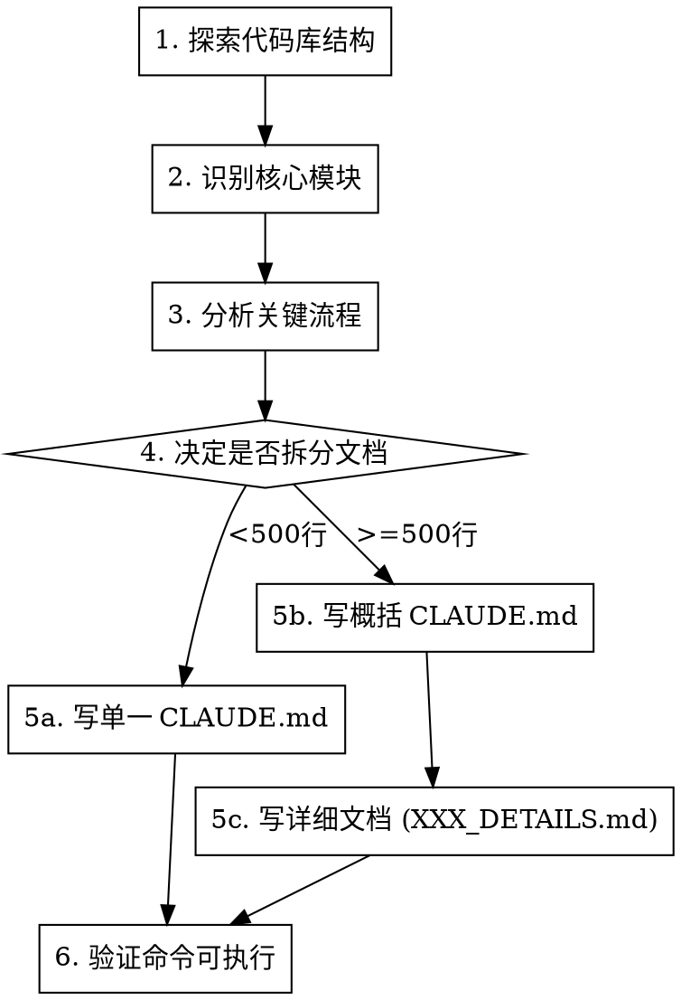

# Document Project

为新项目创建结构化的 CLAUDE.md 文档，帮助 Claude 快速理解代码库。

## Overview

**核心原则**：先理解，后记录；概括在主文档，详解分离到专门文档。

## When to Use

- 接手新项目，需要创建 CLAUDE.md
- 项目缺少文档或文档过时
- 用户说"帮我整理这个项目"、"创建项目文档"
- 深度分析后需要持久化理解

**不适用**：
- 项目已有完善的 CLAUDE.md（用 `claude-md-improver` 改进）
- 只是临时查看代码（不需要持久化）

## Workflow



## Phase 1: 探索代码库

```bash
# 1. 查看目录结构
find . -type f -name "*.py" -o -name "*.ts" -o -name "*.go" | head -50
ls -la
tree -L 2 -I 'node_modules|__pycache__|.git|venv'

# 2. 查看关键配置文件
cat package.json 2>/dev/null || cat pyproject.toml 2>/dev/null || cat Cargo.toml 2>/dev/null

# 3. 查看现有文档
cat README.md 2>/dev/null | head -100
```

## Phase 2: 识别核心模块

| 检查项 | 查找方式 |
|--------|---------|
| 入口文件 | `main.py`, `app.py`, `index.ts`, `cmd/` |
| 配置系统 | `config/`, `settings.py`, `.env.example` |
| 核心模型 | `models/`, `schemas/`, `types/` |
| API/接口 | `api/`, `routes/`, `handlers/` |
| 工具函数 | `utils/`, `helpers/`, `lib/` |

## Phase 3: 分析关键流程

重点理解：
1. **数据流**：输入 → 处理 → 输出
2. **依赖关系**：模块间如何调用
3. **配置方式**：环境变量、配置文件
4. **构建/运行**：如何启动、测试、部署

## Phase 4: 文档拆分决策

| 条件 | 决策 |
|------|------|
| 预估内容 < 500 行 | 单一 CLAUDE.md |
| 预估内容 >= 500 行 | 拆分：CLAUDE.md (概括) + XXX_DETAILS.md (详解) |
| 有复杂子系统 | 每个子系统可有独立详解文档 |

**拆分原则**：
- 主文档：快速参考（命令、配置、路径）
- 详解文档：深度理解（架构图、流程图、代码位置）

## Phase 5: 撰写文档

### CLAUDE.md 必须包含

```markdown
# CLAUDE.md

## Project Overview
一句话描述项目用途

## Environment Setup
```bash
# 可直接复制执行的命令
```

## Common Commands
```bash
# 构建、测试、运行命令
```

## Architecture Overview
简化的目录结构说明

## Key Configuration
重要配置项和默认值
```

### 可选章节（按需添加）

- **API Reference**：接口说明
- **Data Models**：核心数据结构
- **Testing**：测试命令和策略
- **Deployment**：部署流程
- **Troubleshooting**：常见问题

### 详解文档结构 (XXX_DETAILS.md)

```markdown
# XXX 详解

> 快速参考请查看 [CLAUDE.md](./CLAUDE.md)

## 目录
[按模块组织]

## 模块 1: XXX
### 架构图
### 数据流
### 代码位置
### 关键函数说明
```

## Phase 6: 验证

- [ ] 所有命令可直接复制执行
- [ ] 路径正确存在
- [ ] 配置项与代码一致
- [ ] 链接有效

## Quick Reference: 文档质量标准

| 标准 | 好 | 差 |
|------|----|----|
| 命令 | 可直接执行 | 需要修改才能运行 |
| 路径 | 实际存在 | 假设或过时 |
| 解释 | 说明"为什么" | 只说"是什么" |
| 长度 | 精简有价值 | 冗长废话多 |
| 结构 | 易于扫描 | 一大段文字 |

## Common Mistakes

| 错误 | 正确做法 |
|------|---------|
| 主文档过长 | 拆分到详解文档 |
| 复制代码注释 | 提炼关键信息 |
| 命令不可执行 | 先测试再记录 |
| 描述显而易见的内容 | 聚焦非显而易见的知识 |
| 创建过多文档 | 一个主文档 + 按需拆分 |

## Output Artifacts

| 文件 | 用途 | 位置 |
|------|------|------|
| CLAUDE.md | 主文档（概括） | 项目根目录 |
| *_DETAILS.md | 详解文档 | 项目根目录 |
| COMMANDS.md | 命令速查（可选） | 项目根目录 |

## Integration with Other Skills

- **claude-md-improver**: 用于改进已有的 CLAUDE.md
- **revise-claude-md**: 用于更新 CLAUDE.md 以反映会话中的学习
