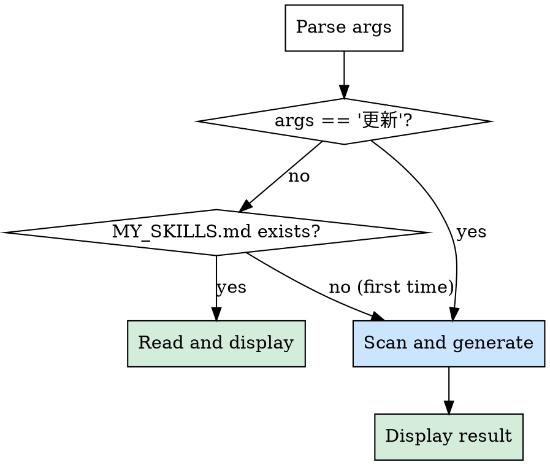

# My Skills

显示或更新个人技能速查表。

## 调用方式

```
/my-skills              # 显示已有速查表（读取缓存）
/my-skills 更新         # 重新扫描所有 skill，更新速查表
```

## 执行流程



### 显示模式（默认）

直接 Read `~/.claude/skills/MY_SKILLS.md`，将内容输出给用户。

### 更新模式（`/my-skills 更新`）

1. 遍历 `~/.claude/skills/*/SKILL.md`，**跳过 my-skills 自身**
2. 提取 name、调用命令、功能概述
3. 按分类整理：

| 分类       | 包含                                               |
|------------|---------------------------------------------------|
| 开发工具   | 代码审计、开发规划、提交、文档等                    |
| 知识管理   | 知识库查询、保存等                                  |
| 内容分析   | URL 总结、平台分析等                                |
| 编辑器集成 | Obsidian、Canvas、Notion 等                         |

4. 覆盖写入 `~/.claude/skills/MY_SKILLS.md`
5. 输出更新后的内容

### MY_SKILLS.md 格式

```markdown
# 技能速查表

> 更新时间：YYYY-MM-DD HH:MM
> 技能总数：N 个

## 开发工具

| 技能 | 命令 | 功能 |
|------|------|------|
| ... | ... | ... |

## 知识管理
...

## 内容分析
...

## 编辑器集成
...
```
