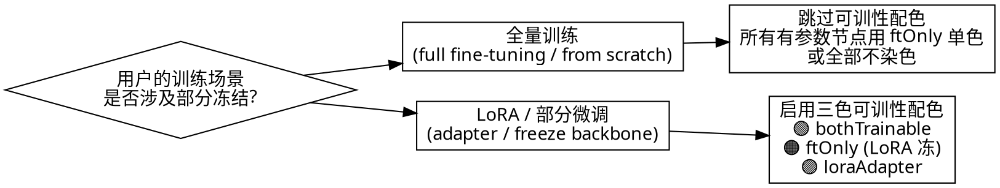
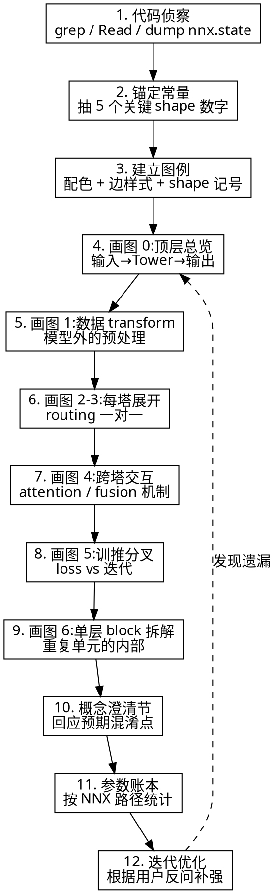

# Network Pipeline Walkthrough

把一个复杂神经网络的数据通路、参数划分、训推差异、可训性,**端到端讲透**——目标读者是工程师而非论文读者,要能拿着这份说明对着代码读、对着 wandb 看、对着 ckpt 调。

## 成果交付(契约)

**最终产物固定是一个单文件 Markdown 文档,不是聊天回复、不是 HTML、不是 PDF**。

| 项 | 要求 |
|---|---|
| 文件类型 | 单个 `.md` 文件 |
| 默认路径 | `docs/<model_name>_pipeline.md`(项目根目录下的 `docs/` 子目录;若无则创建) |
| 命名约定 | 用模型主名小写 + 下划线,如 `pi05_libero_pipeline.md`、`llava_pipeline.md`、`rt2_pipeline.md` |
| 图表渲染 | 全部用 **Mermaid**(```mermaid 代码块)。**禁止** ASCII 框图(终端会乱码)、HTML embed、外链图片 |
| 字体 / 等宽 | 终端阅读器渲染依赖等宽,所以 Mermaid 而非纯 ASCII;表格用标准 GFM `\| col \|` 语法 |
| 代码引用 | 所有结构性事实必须带 `file:line` 引用,格式 `` `<path>/<file>.py:<start>-<end>` ``(单行用 `:N`,范围用 `:N-M`),而不是裸路径或粗粒度的目录引用 |
| 不要做 | 不写 README.md,不写 CLAUDE.md,不创建多文件目录,不输出 ipynb——**就一个 md 文件** |

写完后,在最终回复里给出文件**绝对路径 + 行数**,让用户可以直接 Ctrl+点击打开。如果用户没指定路径,走默认 `docs/<model_name>_pipeline.md`,但**先确认存在 `docs/` 目录或要不要新建**。

输出之外的对话回应只用来:
1. 报告产出路径
2. 解释你做的非显然取舍(比如:"全量训练场景所以跳过了可训性配色")
3. 邀请用户挑刺(进入 Step 12 迭代优化)

**不要**把 md 内容大段贴回对话——那等于用户读了两遍。

### 写入策略:分块,不要一次性 Write 整个大文件

"单个 .md 文件"是**产物**契约,不是**写入方式**契约。整篇 walkthrough 通常 20–35KB,**一次性 Write 全文容易触发 socket 超时**(单个工具调用 payload 过大,加上长上下文里的 skill 全文 + 代码侦察结果 + nnx dump,响应流被拖到超时阈值之上,前端会报 `socket connection was closed unexpectedly`)。

**正确流程**:

1. **第一次 Write**:只写文档骨架(标题 + 三个高层事实 + 五个锚定数 + Shape 记号 + 图例)——大约 4–6KB,稳。
2. **后续逐节 Edit 追加**:每张 Mermaid 图 / 每个章节单独一次 Edit,每次 payload 控制在 ≤ 5KB。一份完整 walkthrough 大约要 6–9 次 Edit。
3. **每次 Edit 后不要回贴写入的内容到对话**——既浪费 token,也会让响应体再次膨胀。

**为什么不行**:把"先写骨架再 Edit 追加"想成"分多次 commit 同一个文件"——单次 commit 体小,中途断了只丢一节,从断点继续即可,不必从头重来。一次性大 Write 一旦断在中途,文件可能写了一半,排查 + 重写代价远高于多次小写入。

**例外**:如果文档本身就 < 8KB(简单 MLP / 单塔小网络),一次 Write 即可,不要为分块而分块。

## 核心原则

1. **代码为锚点,不是论文**——每个 shape、每个模块、每个 layer 数都要附 `file:line` 引用。如果不知道某个值具体是多少,**就去跑代码确认**(grep / Read / `python -c`),不要凭直觉写。
2. **多层缩放,不是一图到底**——顶层总览 + 每塔展开 + 单层 block 拆解,三种 zoom level 各画一张图,各回答不同的问题。
3. **训推不混淆**——前向路径、反向梯度、参数更新这三件事用不同颜色 / 边样式区分。
4. **可训性标记按场景启用**——仅当用户讨论的是 **LoRA / partial fine-tuning / 部分冻结** 时才使用 🟢/🟠/🟣 三色可训性配色;**全量训练时所有参数都训,标 "哪些可训" 是冗余,跳过**这套配色,只用普通节点色。
5. **概念澄清优先于堆砌细节**——遇到容易混的术语(token ID vs embedding、双向 vs 因果 attention、模块 vs 操作),先单独解释,再继续主流程。
6. **Routing 严格一对一**——每个输入字段必须明确路由到具体子模块(`prompt 进 LLM embedder` 而不是 `prompt 进 LLM`),Mermaid 边的 from/to 必须落在叶子节点上,不能停在 subgraph 边界。
7. **Stage 编号串联总图和子图**——读者在总图和子图之间跳来跳去时,需要稳定 anchor 知道"我现在放大到哪一段了"。给图 0 总览的每个大区域打上 `Stage N` 标志(数据 / Prefix Tower / Suffix Tower / 联合 attention / 训推分叉 / 环境输出),后续每张子图标题、章节标题、跨图引用全部沿用同一套编号。**Stage 编号一旦定下不要改顺序**——文档里所有处都以它为锚点。

## 开始之前:决策分支(决定要不要标可训性)

写第一张图之前先确认场景,决定后续配色密度:



**判定方法**:在该网络代码里搜索 freeze / requires_grad / PEFT / LoRA / adapter / 模型变体名字带 `_lora` `_lite` `_base` 等后缀的差异;在用户表述里搜索 "LoRA"、"adapter"、"冻结"、"low_mem"、"PEFT"、"linear probing"、"head-only" 等关键词。任一命中即视为部分微调场景,启用三色;否则默认全量训练,**不要主动加可训性标记给读者增加认知负担**。

| 场景 | 节点配色策略 | 例子 |
|---|---|---|
| **全量训练** | 所有有参数节点用一种颜色(或不染色),只标 ⚪op / 🟡 trainOnly / 🔵 inferOnly 这些**功能性维度** | 从零训练、纯 full FT、不存在冻结决策 |
| **LoRA / 部分微调** | 启用 🟢/🟠/🟣 三色,显式标出可训 / 冻 / adapter | `pi05_libero_low_mem_finetune`、PEFT 微调、ControlNet 训练 |
| **混合(用户两种都关心)** | 文档头部说明"以 LoRA 为视角,全量训练把 🟠 看作 🟢 即可" | 用户既要懂全量也要懂 LoRA 的对照 |

## When to Use

- 用户接手一个复杂模型,想搞懂数据怎么流的
- 准备做微调 / LoRA / 改架构,需要先确认哪些参数会被更新
- 排查 OOM、shape mismatch、训推行为不一致——先看清 pipeline 才能定位
- 写技术文档 / onboarding 材料,目标是让别人快速 ramp up
- 用户问"为什么这里是这样设计"——通常需要把一段 pipeline 还原出来才能回答

**不适用**:

- 单一前向 MLP / 简单 CNN——几行字能讲清,不需要这么重的产物
- 用户只想要某个特定 shape 或某个 op 的解释——直接答即可,不要硬上完整 walkthrough
- 没有可读源码(只有 ONNX / 黑盒模型)——`file:line` 引用做不出来,降级为概念讲解

## Workflow



## Step 1 — 代码侦察(必做,不能跳)

在画任何图之前,先用代码确认底层事实。**不要凭论文记忆或常识写 shape**——同一个名字的模型(Gemma-2B、ViT-L)在不同实现里参数数和 shape 可能不一样。

必查项:

- 模型 config 文件(`*_config.py`)——拿 width / depth / num_heads / mlp_dim / vocab_size / max_token_len
- 主 forward 入口(`compute_loss` / `__call__` / `forward`)——看 prefix / suffix 怎么切分
- Embed / token 生成函数(`embed_prefix` / `embed_suffix`)——看输入是怎么被组装成序列的
- Freeze filter / LoRA 配置(`get_freeze_filter` / `freeze_filter`)——确定可训性
- 实际 dump `nnx.state(model, nnx.Param)` / `model.named_parameters()`——拿真实路径名

**典型 grep 序列**(替换关键字为该网络代码里实际用的术语):
```bash
# 1. 抓维度类常量(具体名字看代码,如 depth/width/dim/num_layers/num_heads/hidden_size 等)
grep -nE "depth|width|dim|hidden|num_heads|num_layers|mlp_|max_.*_len" path/to/config.py
# 2. 抓主 forward 入口
grep -nE "def compute_loss|def forward|def __call__|def embed|def step" path/to/model.py
# 3. 抓冻结 / LoRA / 微调相关
grep -nEi "freeze|frozen|requires_grad|lora|adapter|peft" path/to/config.py path/to/model.py
```

如果有跑得起来的 venv,**直接 dump 参数路径**——根据框架选一种:

```bash
# JAX / Flax NNX
.venv/bin/python -c "
import jax; from flax import nnx; from your.module import Config
cfg = Config(...); model = cfg.create(jax.random.key(0))
state = nnx.state(model, nnx.Param)
# walk paths and print
"

# PyTorch
.venv/bin/python -c "
from your.module import Model
m = Model(...).eval()
for name, p in m.named_parameters():
    print(name, tuple(p.shape), p.numel())
"
```

这一步的产出是一个**事实清单**,后续所有图和文字都基于它。

## Step 2 — 锚定 5 个常量

挑出 5 个左右**该网络中最关键的**维度数字,放在文档开头当"读图基准"。**类型与具体值随网络而定**——下面只是常见类别(具体取哪几条按网络结构决定):

| 常见类别 | 该网络该挑什么(任选 ~5 条) |
|---|---|
| 输入 / 输出维度 | 输入序列长度、输出维度、动作 / 类别 / 词表维度等 |
| 序列长度上限 | 最大 token 数、上下文窗口、任务步数等 |
| Hidden 宽度 | 各塔 / 各专家 / 各分支的 hidden dim |
| Token 数 / Patch 数 | 视觉 patch 数、文本 token 数、合并 sequence 长度 |
| Layer 数 / Depth | transformer 层数、卷积阶段数等 |
| 关键超参 | head 数、KV head 数、rank、专家数、迭代步数等 |

每条都要带 `file:line` 引用。这些数字会反复出现在所有 shape 标注里,先把它们建立成"常识"。挑选原则:**这个数字至少在文档后面被引用 3 次以上**——一次性出现的没必要锚定。

## Step 3 — 建立图例

图例分**两类信息维度**(必有)+ **一类条件维度**(LoRA / 部分微调时才用):

### A. 必有:边样式(训推分支维度)

无论什么场景,这套都要标:

```
==>   粗绿实线    训练专属路径(只在 train_step 中存在)
-.->  灰虚线      推理专属路径(只在 sample/inference 中存在)
-->   黑实线      训推共享前向数据流
-.插入.->         LoRA adapter 注入(仅 LoRA 场景需要)
```

### B. 必有:功能性节点配色(数据 / 操作 / 训推附属物)

```
⚪ op         — 无参数操作 / 数据搬运 / 形状变换(transform、attention 计算、mask 拼接、激活函数等)
🟡 trainOnly  — 仅训练时构造的对象(GT 标签、采样噪声、各类辅助变量、loss、反向梯度等)
🔵 inferOnly  — 仅推理时构造的对象(缓存数据结构、迭代式解码状态、后处理变量等)
```

如果是**全量训练场景**,有参数的模块用一个统一颜色(推荐用 `param` 浅蓝绿色或不染色),不要再分"训"/"冻"/"adapter"——所有都训,分类没意义。

```mermaid
classDef param fill:#fd7e14,stroke:#dc6502,stroke-width:2px,color:#fff
classDef op fill:#e9ecef,stroke:#6c757d,color:#000
classDef trainOnly fill:#fff3cd,stroke:#ffc107,stroke-width:2px,color:#000
classDef inferOnly fill:#cfe2ff,stroke:#0d6efd,color:#000
```

### C. 仅 LoRA / 部分微调场景:三色可训性配色

**只有判定为 LoRA / 部分冻结场景时,才追加这套。否则跳过整节。**

```
🟢 bothTrainable  — 全参 FT 训 + LoRA 也训(顶层小投影、视觉塔等不在 freeze 范围内的模块)
🟠 ftOnly         — 全参 FT 训 / LoRA 冻(LLM 主干、被 freeze filter 命中的模块)
🟣 loraAdapter    — 仅 LoRA 模式存在的低秩 adapter
```

Mermaid classDef 追加(在上面 B 的基础上):

```mermaid
classDef bothTrainable fill:#28a745,stroke:#1e7e34,stroke-width:2px,color:#fff
classDef ftOnly fill:#fd7e14,stroke:#dc6502,stroke-width:2px,color:#fff
classDef loraAdapter fill:#9333ea,stroke:#6b21a8,stroke-width:2px,color:#fff
```

> **决策规则**:对于一个有参数的节点,先问"这个网络是不是涉及部分冻结?":
> - 否 → 用 `param` 单色(B 集合)
> - 是 → 进一步问"这个节点在 LoRA 模式下是训还是冻?",用 🟢 / 🟠 / 🟣 区分(C 集合)

### D. 必有:Shape 记号约定(读图前必须解释)

新建一节专门讲:`B` 是什么、文档里出现的几种典型 shape 各表示什么、每个轴是什么物理量、关键非平凡数字(序列长度上限、token 数上限、hidden 宽度等)是从哪个常量推出来的。**不要假设读者已经懂这些**——这是最常见的卡点。

模板(用变量,具体数字按本网络填):

```
[B]              一维标量,每样本一个值(典型:scalar 标签、time step、score)
[B, L]           二维整数 / float,L = 序列 / 位置 / 步数维(典型:token IDs、mask)
[B, L, D]        三维 embedding,D = hidden 宽度
[B, H, W, C]     四维图像张量,通道在最后(NHWC)或者 [B, C, H, W](NCHW),要明确
```

每个出现的非平凡数字(`L = 200` 这种)都要解释**它来自哪个 config 常量、为什么是这个值、是否会随数据 / 配置变化**。

(这一节和场景无关,全量训练 / LoRA 都需要。)

## Step 4-9 — 画图(分层展开)

### 图 0:顶层总览

- 显示数据从原始输入 → transform → Tower(s) → loss / env action 的全链路
- Tower 用 `subgraph` 容器,内部子模块用单独节点(不要把所有信息塞在一个节点的 `<br/>` 文字里)
- **每条入口边必须带形状标签**,且**目标必须是 Tower 内的具体子节点**而不是 Tower subgraph 本身
- 训练专属路径(GT → loss)用 `==>`,推理专属(env action)用 `-.->`
- Tower 内部每个子模块按可训性配色
- **必须给每个大区域打 Stage 编号**——直接写在 subgraph title 或大节点 label 里,例:
  - `subgraph Stage_K["<b>Stage K</b> — <模块名>"]`
  - `Raw["<b>Stage 1</b><br/><该网络原始输入>"]`
  - 编号原则:**按数据流先后**给每个不可分割的语义阶段连续编号。常见骨架(具体阶段数量与命名按网络调整):
    1. 原始数据
    2. 数据 transform / 预处理
    3. 输入汇总(若有)
    4. 主干第 1 段(典型:encoder / 第一座塔 / backbone)
    5. 主干第 2 段(若有第二座塔 / decoder / 第二条分支)
    6. 跨段交互(联合 attention / fusion / cross-attention,若有)
    7. 训推分叉(loss vs 采样 / 解码迭代)
    8. 输出后处理(unnormalize / detokenize 等)
  - **后续所有子图必须沿用同一套编号**——一旦定下不再改顺序

### 图 1:数据 transform

- 模型**外面**的预处理:tokenize、resize、normalize、pad
- 这些一般是无参数操作,几乎全是 ⚪ op 配色
- 关键是说清楚每个原始字段经过几次 transform 后形状怎么变

### 图 2-3:每塔 / 每个主干模块分别展开

- 一个模块一图,**画清楚模块内部的子流**
- 输入路由要严格——具名到**最深处的入口子模块**,而不是停在容器边界。例:"<具体输入> 进 <具体子模块>",不是"<具体输入> 进 <整个塔/容器>"
- 显式画出 **subgraph 的最终输出节点**(把模块输出作为一个独立 leaf node,标好形状),不要让 Mermaid 自动从 subgraph 边界出箭头
- 适配器 / 注入式权重(LoRA / ControlNet / IA3 等)用 `-.插入.->` 边强调它**注入在主干 forward 路径内部**(加性 / 调制),不是串联在主干之后
- **子图标题必须回引总图 Stage 编号**——格式 `### 图 N — Stage M:[模块名]`。子图开头一句话回指总图位置(`这是图 0 中 Stage M 的放大`),并说明本模块输出去哪个 Stage(如 `输出 X 流入 Stage M+1 ...`)。这样读者放大 / 缩小都不会迷路

### 图 4:跨段 / 跨塔交互(联合 attention / fusion / cross-attention)

- 这是最容易让人困惑的部分——两个或多个分支输出怎么混合
- 必须画出**交互矩阵 / 通路的形状**(prefix-LM mask、cross-attention pattern、fusion gating 等)
- 用文字补一段:**各分支的权重是独立的还是共享的**、Q/K/V(或对应中间张量)怎么 concat / split / project、混合后怎么分回各分支

### 图 5:训练 vs 推理分叉

- **左右并列**两个 subgraph:`Train` / `Infer`
- 两分支各自显式画出该网络的关键专属步骤,常见模式:
  - **训练分支**:GT 样本 → 加噪 / 加扰 / mask → 模型 forward → 损失计算 → 反向
  - **推理分支**:某种初始化(零向量 / 噪声 / BOS token)→ 可能的缓存 prefill → 迭代或自回归循环 → 后处理
- **每个模块的训 / 推执行次数差异要标清楚**(配合坑 14 的修法)
- 推理时哪些训练期产物被**丢弃 / 不复用**要写清楚(例:某些中间激活、某些训练专属张量),帮读者理解推理路径只走训练路径的子集

### 图 6:单层 block 拆解(可选,但 Transformer / 重复式架构强烈建议)

把"N 层重复 block"拆开,显示一个 block 内部。常见 transformer pre-norm 模板:

```
input → Norm → Attention → 残差1 → Norm → FFN → 残差2 → output
```

(若是 post-norm / RNN cell / conv block / diffusion U-Net block,模板换成对应形态。)

每个子步骤都要带:

- 输入输出 shape
- 主权重 shape(用代码里实际的张量名,如 `<attn_proj_name>: [...]`)
- **关键非平凡技术点**——例如:位置编码方案(加性 / 旋转 / ALiBi 等),attention 类型(MHA / MQA / GQA / FlashAttention),FFN 形态(vanilla GELU / GeGLU / SwiGLU / MoE),归一化位置(pre-norm / post-norm / sandwich-norm),归一化类型(LayerNorm / RMSNorm / GroupNorm / adaLN / adaRMS),残差是否有 gate 等
- 适配器 / LoRA 的具体注入点(在哪几个权重上加,rank 多少)

## Step 10 — 概念澄清节(预防混淆)

在 walkthrough 完成后,加一节"容易混淆的 N 个概念",每条都要:

- 命名两个易混的术语
- 给一个具体例子区分它们
- 说明在本网络里它们各对应代码哪一行

**常见混淆 checklist**(具体相关性按网络挑选):

| 混淆点 | 区分方式 |
|---|---|
| Token ID vs Token embedding | 整数张量 `[B, L]` vs float 张量 `[B, L, D]`;前者由 tokenizer 产出,后者由 embedder 查表后产出。说"token"时要明确指哪个阶段 |
| Tokenizer vs Embedder | 前者在数据 transform 阶段(模型外,产整数);后者是模型第一层(查表,产 float)。**两者都属于"把符号变成可处理对象"流程,但生命周期完全不同** |
| 模块(layer) vs 操作(op) | 同一动作可被同时描述为"layer"(从参数容器视角)和"op"(从 forward 计算视角)——不冲突 |
| 双向 attention vs 因果 attention vs prefix-LM | mask 的形态决定:全 1 → 双向(BERT-style);下三角 → 因果(GPT-style);两段拼接 → prefix-LM |
| MHA vs MQA vs GQA | 看 num_kv_heads 与 num_heads 的比值:相等 = MHA;相等于 1 = MQA;1 < num_kv_heads < num_heads = GQA |
| 梯度流过 vs 参数被更新 | 部分微调 / LoRA / 冻结模式下,梯度必须流过冻结部分到达可训部分,但优化器只更新可训部分。**省显存的本质来自优化器状态而非主权重** |
| 前向占的显存 vs 训练占的显存 | 前者只算激活 + 主权重;后者还要加优化器状态(常 4–8× 主权重大小)+ EMA + 梯度副本 |
| 训练时跑 1 次 vs 推理时跑 N 次 | 见坑 14——某些模块训推执行次数不对称,要分别讲清楚 |

## Step 11 — 参数账本

按参数路径精确分类参数,**用实际 dump 出来的路径和数值,不要估算**。表的列在不涉及部分微调时可以简化:

```
全量训练场景表头:
| 模块 | 路径前缀 | 参数量 | 备注 |

LoRA / 部分微调场景表头:
| 模块 | 路径前缀 | 参数量 | 全参 FT | LoRA / 部分微调模式 |
```

每行的"为什么这部分被训 / 被冻"都要给具体理由(对应该网络的 freeze filter 规则、PEFT 配置或 `requires_grad` 设定)。**这个表能直接驱动 OOM 排查和显存估算**,价值极高。

## Step 12 — 迭代优化(关键)

第一遍写完后,**主动让用户挑刺**:

- 哪个节点你看不清是干嘛的?
- 哪个 routing 你觉得没说明白?
- 哪个数字你不知道是怎么来的?
- 哪个模块的执行次数不清楚?

每次用户指出一个问题,就在文档里加一节专门展开——比如某个 magic number 怎么算出来、某个看似该冻的模块为什么实际在训、某个抽象 box 内部到底长什么样。

**不要试图一次写完所有细节**——读者的困惑路径才是文档详略的最佳指南。

## Output 模板

最终产物结构(写到 `docs/<model>_pipeline.md`):

```
# <Model name> Pipeline

## 三个高层事实(读者拿到这页就该知道的)
## 五个锚定数(关键 shape 常量)
## Shape 记号约定
## 参数账本对照表(全量训练单列;若有部分微调,加一列对照)
## 总流程图(分阶段 Mermaid 详图)
  ### 图例(节点配色 + 边样式)
  ### Stage 编号导航表(总图前置,8 个 Stage 一览)
  ### 图 0:顶层总览
  ### 图 1 — Stage 2:数据 transform
  ### 图 2 — Stage 4:<主干第 1 段> 详细
  ### 图 3 — Stage 5:<主干第 2 段> 详细(若有)
  ### 图 4 — Stage 6:跨段 / 跨塔交互(若有)
  ### 图 5 — Stage 7:训练 vs 推理分叉
  ### 单层 block 拆解(若是 transformer / 重复结构,放在合适的 Stage 下)
## 容易混淆的概念
## 参数账本(按真实路径,实测 dump)
## 反直觉点 / FAQ
```

## Common Pitfalls(已知会踩的坑)

1. **把"模块"和"操作"对立起来**——同一个层既是查表 op 也是参数容器,不是二选一
2. **把 PEFT / 部分微调的可训参数描述得太小**——freeze filter 的覆盖范围常常和直觉不符(典型:某些视觉 / 投影模块路径不在过滤器内,实际仍训),**必须实际 dump 才能验证可训部分**
3. **只画一个总图**——所有信息塞进一图必然过拥挤,**坚持分层展开**
4. **用单 node 文字表达多个子模块**(如 `Tower[模块A<br/>模块B<br/>模块C]`)——用 subgraph 容器代替,每个子模块独立节点
5. **边的起点 / 终点是 subgraph 而不是节点**——Mermaid 渲染会从子图边界引出,看不出具体哪个节点出来,**始终用叶子节点连接**
6. **shape 标注省略 batch 维**——读者不一定每次都记得 B 是什么,**所有 shape 都从 `[B,` 开始写**
7. **混用"层数"和"参数量"**——18 层 vs 2B 参数是两个独立维度,讲深度时不要混入参数账
8. **训推路径用同一种边样式**——必须用 `==>` / `-.->` / `-->` 区分,否则读者无法判断哪条线在什么时候活跃
9. **一次性 Write 整篇 20KB+ 文档**——单次工具调用 payload 太大,叠加长对话上下文后容易把 socket 打超时(报 `socket connection was closed unexpectedly`)。**先写骨架,再多次 Edit 逐节追加**,见 `成果交付` 下的"写入策略"
10. **Mermaid 边把两种 label 语法叠加**——`-. text .->` 和 `-.->|"label"|` 是**互斥**的两种写法,**不能合写**成 `-. text .->|"label"|`(Mermaid 会报 `Syntax error in text`)。同理 `==>` 和 `==>|...|`、`-->` 和 `-->|...|` 也只能选一种。需要在一条边上同时表达"动作含义"和"形状标注"时,把含义并入 pipe-label 里:`-.->|"<张量名> [shape]<br/>(<动作含义>)"|`,而不是 `-. <动作含义> .->|"<张量名> [shape]"|`
11. **总图没打 Stage 编号 / 子图标题没回引**——读者来回切换总图和某张子图时找不到自己在哪。图 0 的每个大区域必须显式标 `Stage N`,后续每张子图标题必须是 `### 图 N — Stage M:[内容]`,并在子图开头一句话回指总图位置。见核心原则第 7 条。
12. **分布式构造的对象没标"本段 vs 完整"**——凡是"多个 stage 各产一段,后续 stage 才合并"的对象(典型形态:跨塔/跨模态拼接的 attention mask、token 序列、KV cache,多分支汇聚的 loss 张量等),在某个子图里只显示"自己那一段"时,会和总图或合并图里显示的"完整版"形状对不上,读者会脱口问"这里写 N,那里写 M,到底哪个对?"。**修法**:显示局部段的节点 label 必须**显式标注四件事**:(a) 标明这是局部贡献(用"本段"/"本塔自产的那部分"等措辞,而不是直接写名字让读者猜);(b) 局部段的形状 / 长度;(c) 完整版在哪个 stage、哪张图被拼出来,完整形状是什么;(d) 本 stage 不感知其它 stage 同名对象。这样读者无论从局部图还是全局图进入,都能立刻定位现在看的是局部还是完整。
13. **子图直接堆细节,读者抓不住主线**——一个聚合模块(tower / fusion block / pipeline 段)内部往往有 4–6 个子组件,读者看完会问"这个模块到底是干嘛的?"。**修法**:每张子图标题与 Stage 回引之后,必须有**一句话"作用陈述"**,格式 `本模块作用:输入 X(+ Y + ...) → 输出 Z,[一句类比或核心目的]`。先把 input→output 主映射立住,再讲内部组件**如何为这个映射各司其职**。聚合性越强的模块(多输入流融合、多塔联合、内部多步条件注入、含子模块嵌套)越要写这一句——它是"主线"和"细节"之间的桥。少了这句,读者就会迷失在子组件里找不到出口。
14. **训推执行次数不一致的模块没标注**——读者默认假设每个模块"一次 forward 就完事"。但实际上很多模块在**训练 1 次 vs 推理 N 次**(被缓存绕过的 encoder / prefill,迭代式 decoder,扩散/流匹配类去噪网络,自回归 / beam search,多步 rollout planner 等),反过来也存在(EMA 的两路并行、辅助 loss 的多分支)。读者看不到次数差异就会**误判推理成本、实时性可行性、显存占用**(KV cache 收益尤其要靠这个数字才能解释)。**修法**:对**任何执行次数 ≠ 1 的模块**,在该模块的节点 label 或子图开头的"作用陈述"里显式标注 `训练 N₁ 次 / 推理 N₂ 次`(N 可以是常数也可以是变量,如 `=action_horizon`、`=num_steps`、`=beam_size·T`)。次数为 1 的模块默认不标。同一对象在某 Stage 跑 1 次另一 Stage 跑 N 次的不对称(如 prefix prefill 后 KV cache 复用)还要补一句**"为什么不对称"**,否则读者抓不到设计意图。

## Quality Checklist(交付前自检)

- [ ] 每张图每条边都标注了 shape
- [ ] 每个有参数的节点都标了配色
- [ ] 每个 shape 数字都能在锚定数表 / Shape 记号约定里找到对应
- [ ] 至少一张图显式画出**训练专属路径**(GT/标签 → loss 的链路用 `==>`)
- [ ] 至少一张图显式画出**推理专属路径**(`-.->` 标记;含缓存 / 迭代 / 自回归 / 后处理等推理特有步骤)
- [ ] 参数账本里每行的"为什么训 / 为什么冻"都有具体理由(对应该网络实际的 freeze 规则)
- [ ] 部分微调 / PEFT 模式的可训参数总量是**实际 dump 出来的**,不是估算
- [ ] 至少 3 处概念澄清(其中至少 1 条覆盖该网络中"看似只是命名差异、实为 stage 不同"的对象,如 token ID vs token embedding 这类)
- [ ] 单层 block 内部至少展开过一次(对 transformer / 重复式架构)
- [ ] 文档头部 5 个锚定数 + Shape 记号约定 + 图例 三件套齐全
- [ ] 总图(图 0)每个大区域都打了 Stage 编号,后续每张子图标题都按 `### 图 N — Stage M:[内容]` 回引
- [ ] 任何执行次数 ≠ 1 的模块都标注了 `训练 N₁ 次 / 推理 N₂ 次`,不对称的还配了"为什么"
- [ ] 每个聚合模块开头有"作用陈述"一句话(input → output 主映射),而不是直接堆细节
