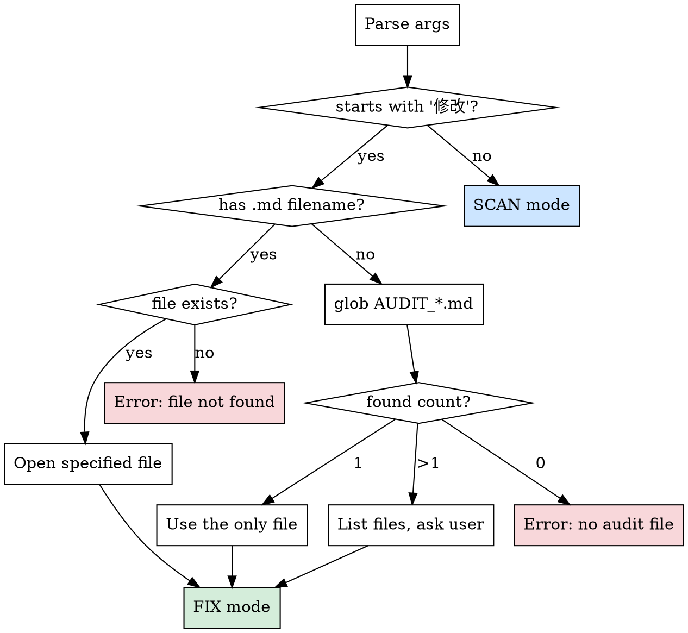

# Project Audit

对工程进行多维度审计扫描，生成可批复的审查表，并根据批复执行修复。

## 调用方式

```
/project-audit 汇总                    # 全方位扫描（风险+优化+工程规范）→ 生成 AUDIT_汇总.md
/project-audit 风险项                  # 扫描安全与稳定性风险 → 生成 AUDIT_风险项.md
/project-audit 优化项                  # 扫描性能与代码质量   → 生成 AUDIT_优化项.md
/project-audit <自定义方向>            # 按指定方向扫描       → 生成 AUDIT_<方向>.md
/project-audit 修改 AUDIT_风险项.md    # 指定审查表文件执行修复（推荐）
/project-audit 修改                    # 未指定文件 → 自动扫描 AUDIT_*.md 再定位
```

## 文件命名规范

每次扫描在**项目根目录**生成独立审查表，文件名格式：

```
AUDIT_<方向>.md
```

| 扫描命令                        | 生成文件                 |
|---------------------------------|--------------------------|
| `/project-audit 汇总`          | `AUDIT_汇总.md`          |
| `/project-audit 风险项`         | `AUDIT_风险项.md`        |
| `/project-audit 优化项`         | `AUDIT_优化项.md`        |
| `/project-audit 内存管理`       | `AUDIT_内存管理.md`      |
| `/project-audit thread-safety`  | `AUDIT_thread-safety.md` |

同一方向重复扫描时，**询问用户**是覆盖还是追加。

## 模式判断



---

## SCAN 模式（风险项 / 优化项 / 自定义）

### 1. 确定扫描维度

| 参数       | 扫描维度                                                         |
|------------|------------------------------------------------------------------|
| `汇总`     | **全方位**：风险项 + 优化项 + 工程规范，一次出完整报告           |
| `风险项`   | 安全漏洞、缓冲区溢出、内存泄漏、线程安全、敏感信息泄露、工程规范 |
| `优化项`   | 性能瓶颈、代码冗余、架构改进、编译优化、依赖精简                 |
| 自定义     | 按用户描述的方向扫描                                             |

### 2. 启动并行扫描 Agent

使用 Task 工具启动并行 Explore Agent，各负责不同子方向。

**汇总模式（4 个 Agent）**：
- **Agent 1 — 代码安全**：缓冲区溢出、空指针、内存泄漏、线程安全、exit() 滥用
- **Agent 2 — 敏感信息与工程规范**：硬编码密码/IP、.gitignore、大文件、git 历史
- **Agent 3 — 性能与代码质量**：性能瓶颈、冗余代码、不必要的拷贝、编译优化
- **Agent 4 — 架构与规范**：模块边界、依赖方向、命名规范、配置合理性

**单方向模式（3 个 Agent）**，按方向拆分子任务。示例（风险项模式）：
- **Agent 1 — 代码安全**：缓冲区溢出、空指针、内存泄漏、线程安全、exit() 滥用
- **Agent 2 — 敏感信息**：硬编码密码/IP/用户名、密钥泄露、.gitignore 遗漏
- **Agent 3 — 工程规范**：大文件、未追踪垃圾、git 历史膨胀、临时目录

每个 Agent 的 prompt 中明确要求：
- 给出**文件路径和行号**
- 按严重程度排序
- 用中文总结

### 3. 汇总生成审查表

在项目根目录生成 `AUDIT_<方向>.md`。

### 单方向模式模板

```markdown
# 工程审查 - <方向>

> 扫描日期：YYYY-MM-DD
> 扫描方向：<方向>
> 状态：待批复

## 汇总

| 编号 | 审查项       | 等级   | 批复 | 状态 |
|------|-------------|--------|------|------|
| S1   | 问题简述     | 🔴 P0 |      |      |
| M1   | 问题简述     | 🟡 P1 |      |      |
| L1   | 问题简述     | 🟢 P2 |      |      |

> **统计**：待批复 N 项

---
> **批复说明**：在「批复」栏填写：修复 / 不修 / 暂缓 / 备注
---

## 🔴 严重（P0）

### S1. 问题标题
- **文件**：`path/to/file:line`
- **现状**：具体描述
- **修复方案**：建议方案
- **批复**：

---
（更多条目...）

## 执行汇总
S1:
M1:
```

### 汇总模式模板（`AUDIT_汇总.md`）

汇总表增加「类别」列，条目详情按类别分组：

```markdown
# 工程审查 - 汇总

> 扫描日期：YYYY-MM-DD
> 扫描方向：汇总（风险 + 优化 + 工程规范 + 架构规范）
> 状态：待批复

## 汇总

| 编号 | 类别     | 审查项       | 等级   | 批复 | 状态 |
|------|----------|-------------|--------|------|------|
| R-S1 | 风险     | 问题简述     | 🔴 P0 |      |      |
| R-M1 | 风险     | 问题简述     | 🟡 P1 |      |      |
| O-M1 | 优化     | 问题简述     | 🟡 P1 |      |      |
| E-L1 | 工程规范 | 问题简述     | 🟢 P2 |      |      |
| A-L1 | 架构规范 | 问题简述     | 🟢 P2 |      |      |

> **统计**：待批复 N 项（风险 X / 优化 Y / 卫生 Z / 架构 W）

---
> **批复说明**：在「批复」栏填写：修复 / 不修 / 暂缓 / 备注
---

## 风险项

### R-S1. 问题标题
- **文件**：`path/to/file:line`
- **现状**：具体描述
- **修复方案**：建议方案
- **批复**：

---

## 优化项
...

## 工程规范
...

## 架构规范
...

## 执行汇总
R-S1:
O-M1:
```

### 编号规则

**单方向模式**：
- `S` = 严重 Severe（🔴 P0）、`M` = 中等 Medium（🟡 P1）、`L` = 轻微 Low（🟢 P2）

**汇总模式**（类别前缀 + 严重程度）：
- `R-` = 风险 Risk、`O-` = 优化 Optimize、`E-` = 工程规范 Engineering、`A-` = 架构规范 Architecture
- 前缀后接 `S/M/L` + 编号，如 `R-S1`、`O-M2`、`H-L3`

### 汇总表规范

- 所有条目的**一行概述**
- 等级用 emoji 标注
- 汇总模式额外带「类别」列
- 批复和状态栏**留空**等待用户填写
- 底部统计行（汇总模式按类别细分）

---

## FIX 模式（修改）

### 0. 定位审查表

**优先级：指定文件 > 自动扫描**

```
/project-audit 修改 AUDIT_风险项.md     → 直接打开该文件
                                           不存在：报错

/project-audit 修改                     → glob AUDIT_*.md
                                           0 个：报错，提示先扫描
                                           1 个：直接使用
                                           N 个：列表展示，让用户选择
```

多文件展示格式：
```
⚠️ 发现多份审查表，请指定要修改哪一份：

  1. AUDIT_风险项.md    (待批复 12 项)
  2. AUDIT_优化项.md    (待批复 8 项)
  3. AUDIT_内存管理.md  (已执行)

用法：/project-audit 修改 AUDIT_风险项.md
```

### 1. 解析批复

| 批复关键词           | 动作                           |
|----------------------|--------------------------------|
| 修复 / 修改 / 删除   | 执行修复                       |
| 暂缓 / 暂时不修改    | 跳过，保留原状态               |
| 不修 / 不处理 / 跳过 | 跳过，标记为 ❌                |
| **空白**             | **默认不修复，跳过，标记为 ⬜** |

> **原则**：只修复明确标记为「修复/修改/删除」的条目，未批复 = 不动。

### 2. 执行修复

对每条标记为「修复/修改/删除」的条目：

1. **读取**对应源文件，理解上下文
2. **执行**修复方案（代码修改 / 文件删除 / 配置更新）
3. **记录**执行结果到该条目的「执行结果」字段

### 3. 更新审查表

- 顶部状态改为 `✅ 已执行`
- 汇总表的「状态」列更新（✅ 已修复 / ⏸ 暂缓 / ❌ 跳过 / ⬜ 未批复）
- 每条已执行项添加 `- **执行结果**：✅ 具体描述`
- 底部执行汇总更新
- 统计行更新为：`✅ 已修复 X 项 / ⏸ 暂缓 Y 项 / ❌ 跳过 Z 项 / ⬜ 未批复 W 项`

### 4. 未批复条目处理

未批复的条目**默认不修复**，汇总表状态标记为 ⬜（未处理）。

执行完成后，在输出末尾附带提示：

```
ℹ️ 以下 N 条未批复，已跳过（如需修复请补充批复后重新执行）：
- S2: strcat 缓冲区溢出
- M3: 线程安全问题
```

---

## 注意事项

- 扫描结果**不自动修改代码**，仅生成审查表
- 必须等用户批复后，通过 `/project-audit 修改` 才执行
- 同一方向重复扫描时，**询问用户**是覆盖还是追加
- 修复过程中若某条修复失败，标记 `❌ 修复失败：原因` 并继续下一条
